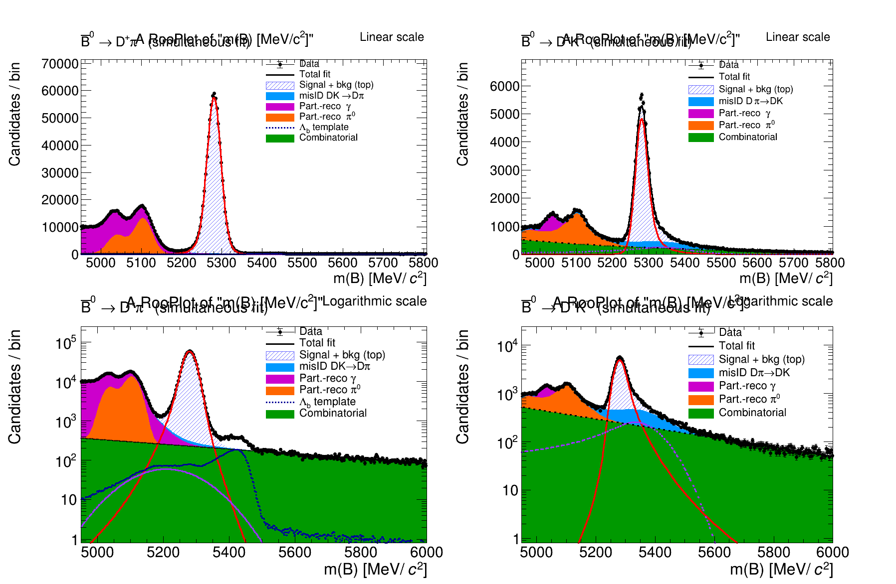

# Simultaneous determination of $\mathcal{B}(\bar{B}^0 \to D^+\pi^-)$ and $\mathcal{B}(\bar{B}^0 \to D^+K^-)$ in LHCb Run 3

Analysis code for an MMath/MPhys master's project at the University of Warwick, supervised by
Dr Nicole Skidmore. Measures the CP-averaged branching fractions of two colour-favoured
$b \to c\bar{u}q$ transitions using approximately 1 fb$^{-1}$ of LHCb Run 3 data
(Blocks 7–8, $\sqrt{s} = 13.6$ TeV, both magnet polarities).

## Result

| | Measured | stat | exp | ext | PDG average |
|---|---|---|---|---|---|
| $\mathcal{B}(\bar{B}^0 \to D^+\pi^-)$ | $2.165 \times 10^{-3}$ | $\pm 0.007$ | $\pm 0.032$ | $\pm 0.069$ | $(2.51 \pm 0.08) \times 10^{-3}$ |
| $\mathcal{B}(\bar{B}^0 \to D^+K^-)$ | $1.933 \times 10^{-4}$ | $\pm 0.014$ | $\pm 0.024$ | $\pm 0.062$ | $(2.05 \pm 0.08) \times 10^{-4}$ |

$$\mathcal{B}(D^+K^-)/\mathcal{B}(D^+\pi^-) = 0.0893 \pm 0.0007_{\text{stat}} \pm 0.0017_{\text{exp}} \pm 0.0040_{\text{ext}}$$

The statistical uncertainty on the ratio is roughly a factor of two smaller than the most
precise existing single measurement. Projected to the full 30 fb$^{-1}$ Run 3 dataset, the
statistical precision on $\mathcal{B}(\bar{B}^0 \to D^+\pi^-)$ improves from
$\sim$0.40% to $\sim$0.06%.



## What the analysis does

Both channels proceed through a single tree-level diagram with strongly suppressed penguin and
annihilation contributions, which makes them clean tests of QCD factorisation. Measurements
have sat consistently below the SM/QCDF predictions — by 5–6$\sigma$ for $D^+K^-$ and 2–3$\sigma$
for $D^+\pi^-$ — a discrepancy known as the $b \to c\bar{u}q$ anomaly.

Two choices shape the analysis:

**Normalising to $B^+ \to J/\psi(\mu^+\mu^-)K^+$ rather than to each other.** Previous
determinations largely measured the ratio $\mathcal{B}(D^+K^-)/\mathcal{B}(D^+\pi^-)$, using one
hadronic decay to normalise the other. Since both originate from the same $b \to c\bar{u}q$
transition, any discrepancy in the normalisation channel propagates straight into the result.
Run 3's fully software-based trigger selects the hadronic signal modes and the muonic
normalisation channel within one common framework, which makes independent normalisation
possible.

**Fitting both hadronic channels simultaneously.** The two samples are separated by mutually
exclusive bachelor-track PID requirements, so they don't overlap — but residual $\pi^-/K^-$
misidentification moves true decays across the boundary in both directions. Fitting the spectra
separately would bias both yields. A combined likelihood constrains that cross-feed, with the
misidentified yields tied to the signal yields through PIDCalib efficiency ratios rather than
floated freely.

## Repository layout

```
notebooks/
  01_normalisation_fit_JpsiK.ipynb    B+ -> J/psi K+ fit; gives N_norm = 136071 +/- 428
  02_lambdab_control_fit.ipynb        Lambda_b -> Lambda_c pi control fit
  03_simultaneous_fit_Dpi_DK.ipynb    main result: simultaneous fit, then branching fractions
exploratory/                          single-channel fits, misID study, early looks
figures/                              publication figures
```

Run 01 → 02 → 03 in order. All three need ROOT, the custom PDF libraries and read access to
the input tuples. The coupling between notebooks is the numeric yields, which are stated
explicitly rather than passed as objects, so each can be read on its own.

Notebook 03 carries the analysis all the way through: selection, templates, the simultaneous
fit, goodness of fit, a background-shape stability check, the publication figures, and finally
the branching fractions and the 30 fb$^{-1}$ projection. Its closing sections need only
`uncertainties` and `math`.

`exploratory/` holds the working history: per-channel fits done before the simultaneous model,
the misidentification template study, PDF-loading tests and first looks at the data. Kept
because the intermediate cross-checks are part of how the final model was arrived at, but it is
not a maintained code path.

## Fit model

**Signal** — double-sided Crystal Ball per channel. The mean $\mu$ and Gaussian core width
$\sigma$ are shared between the two channels, since both decays come from the same parent under
the same detector conditions; the tail parameters float independently to absorb the kinematic
difference between the pion and kaon mass assignments.

**Combinatorial** — exponential.

**Partially reconstructed** — custom `RooHILLdini` and `RooHORNSdini` endpoint shapes. A missing
vector particle (a photon) gives a single-peaked HILL distribution; a missing scalar (a $\pi^0$)
gives the double-peaked HORNS structure. Shape parameters are fixed from dedicated
single-channel fits to avoid correlation with the signal yields.

**Cross-feed** — shapes built data-driven by re-evaluating each bachelor track under the opposite
mass hypothesis at fixed three-momentum. Yields are tied to the signal yields via PIDCalib
bachelor-track efficiency ratios. Assigning the heavier kaon mass to a true pion raises the
reconstructed energy, so the $D^+\pi^- \to D^+K^-$ reflection sits *above* the $D^+K^-$ peak;
the reverse reflection sits *below* the $D^+\pi^-$ peak.

**$\Lambda_b^0$** — $\Lambda_b^0 \to \Lambda_c^+\pi^-$ enters the $D^+\pi^-$ sample when the
proton is misidentified as a pion. Its shape is a `RooHistPdf` template built by re-massing
control-sample candidates event by event, and its yield is Gaussian-constrained around the
control-fit expectation rather than hard-fixed.

## Running it

```bash
pip install -r requirements.txt
jupyter lab notebooks/
```

ROOT is not pip-installable; use an LCG view or conda-forge:

```bash
source /cvmfs/sft.cern.ch/lcg/views/LCG_105/x86_64-el9-gcc13-opt/setup.sh
```

**Custom PDF libraries.** Notebook 03 loads three shared libraries that are not part of stock
ROOT:

- `libRooHILLdini.so`, `libRooHORNSdini.so` — expected under `$HOME/roohill/standalone`
- `libRooJohnsonSU_*.so` — expected under `$HOME/RooJohnsonBuild`

Build these first, or edit the paths at the top of the fit cell.

**Input data.** The tuples live on EOS under `/eos/lhcb/wg/b2oc/` and are readable with a valid
CERN Kerberos ticket and LHCb membership. Paths are declared at the top of the relevant cells.
The notebooks are stored with their outputs intact, so the fits and figures can be read without
re-running anything.

**A note on RooFit output.** Each main notebook opens with a cell that quietens the RooFit
message service. Without it the fits emit thousands of INFO and Eval-topic lines — integrator
setup, plot-projection ranges, and warnings raised while MIGRAD probes regions where a PDF
evaluates negative. Those are normal minimiser behaviour, not failures: every fit in notebook
03 reports `status=0`, `covQual=3`. WARNING, ERROR and FATAL are left switched on, so real
problems still surface.

## Method reference

`docs/Final_Report.pdf` — the full write-up. Equation and table numbers in the notebook
headers refer to it.

## Acknowledgements

Supervised by Dr Nicole Skidmore (University of Warwick). Uses LHCb Run 3 data and the PIDCalib
and Sprucing frameworks. The HILL and HORNS parametrisations follow
[LHCb-PAPER-2017-021](https://arxiv.org/abs/1708.06370).
